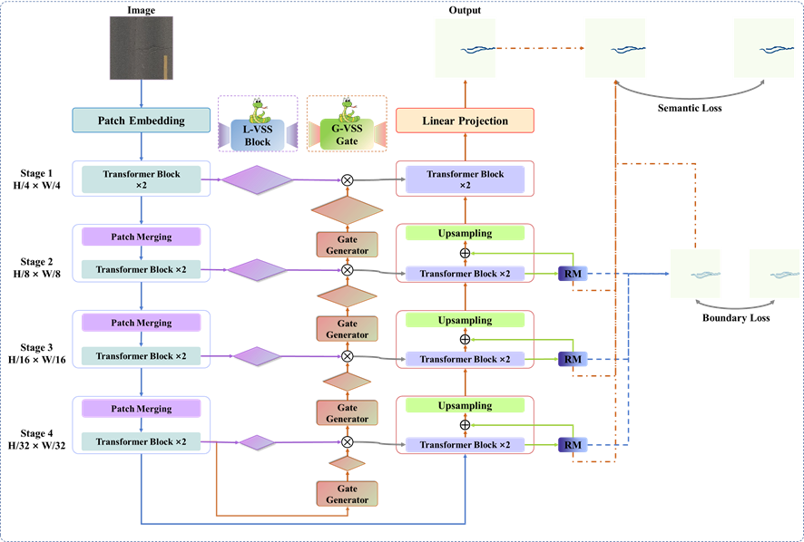

<div align="center">
<h1>GLoU-MiT</h1>
<h3>GLoU-MiT: Lightweight Global-Local Mamba Guided U-Mix Transformer with Deep Supervision Refinement for UAV-based Pavement Crack Segmentation
</h3>
</div>

## Network Architecture
<p align="center">
  
</p>

## Datasets
### 1. Crack500 dataset
The [Crack500](https://ieeexplore.ieee.org/document/8694955) dataset contains 500 images of size around 2000 × 1500 pixels taken by cell phones on main campus of Temple University. And each image was cropped into 16 non-overlapped image regions and only the region containing more than 1000 pixels of crack is kept. Through this way, the training data consists of 1,896 images, validation data contains 348 images, test data contains 1124 images. Download the Crack500 dataset from [this](https://github.com/fyangneil/pavement-crack-detection) link.
```
|-- Crack500
    |-- train
        |-- images
        |   |-- 119.jpg
            ......
        |-- masks
        |   |-- 119.png
            ......
    |-- test
        |-- images
        |   |-- 124.jpg
            ......
        |-- masks
        |   |-- 124.png
            ......
    |-- val
        |-- images
        |   |-- 131.jpg
            ......
        |-- masks
        |   |-- 131.png
            ......
```
### 2. CrackSC dataset
The [CrackSC](https://www.sciencedirect.com/science/article/pii/S0926580522005167) dataset  consists of 197 road damage images (320 × 480 pixels) captured by an iPhone 8 around Enoree Ave, Columbia, SC. This dataset emphasizes complex pavement distress scenes with interference factors like shadows, leaves, and moss, which pose significant challenges to crack detection. Without a predefined dataset division by the authors, we divided it into 99 training images, 19 validation images, and 79 testing images, adhering to a 5:1:4 distribution ratio. Download the CrackSC dataset from [this](https://github.com/jonguo111/Transformer-Crack) link.
```
|-- CrackSC
    |-- train
        |-- images
        |   |-- 20160222_081011_1_361.jpg
            ......
        |-- masks
        |   |-- 20160222_081011_1_361.png
            ......
    |-- test
        |-- images
        |   |-- 20160222_080933_361_1.jpg
            ......
        |-- masks
        |   |-- 20160222_080933_361_1.png
            ......
    |-- val
        |-- images
        |   |-- 20160222_080850_1_361.jpg
            ......
        |-- masks
        |   |-- 20160222_080850_1_361.png
            ......
```
### 3. UAV-Crack500 dataset
The [UAV-Crack500](https://ieeexplore.ieee.org/document/10598826) dataset contains 500 images with a size of 672 × 378 pixels, captured using a drone flying at an altitude of 50 meters with a 4× zoom camera at a speed of 2.5 meters per second. The original images had a resolution of 2688 × 1512 pixels, corresponding to a ground coverage area of 16 meters by 9 meters, with a pixel size of 6 millimeters by 6 millimeters. The images were cropped to 672 × 378 pixels to focus on the minor proportions of cracks. The dataset includes various interfering factors such as different lighting conditions, shadows from trees, and manhole covers. The images were randomly divided into a training set (250 images), a validation set (50 images), and a test set (200 images). 
```
|-- UAV-Crack500
    |-- train
        |-- images
        |   |-- DJI_20221011133543_0038_Z_20.jpg
            ......
        |-- masks
        |   |-- DJI_20221011133543_0038_Z_20.png
            ......
    |-- test
        |-- images
        |   |-- DJI_20221011133713_0083_Z_22.jpg
            ......
        |-- masks
        |   |-- DJI_20221011133713_0083_Z_22.png
            ......
    |-- val
        |-- images
        |   |-- DJI_20221011133747_0100_Z_20.jpg
            ......
        |-- masks
        |   |-- DJI_20221011133747_0100_Z_20.png
            ......
```
## License  
This project is released under the [Apache 2.0 license](LICENSE).

## Acknowledgement
Thanks to [Mamba](https://github.com/state-spaces/mamba), [VMamba](https://github.com/MzeroMiko/VMamba), and [LocalMamba](https://github.com/hunto/LocalMamba) for their outstanding work.
